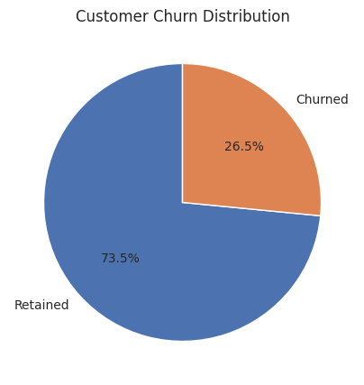
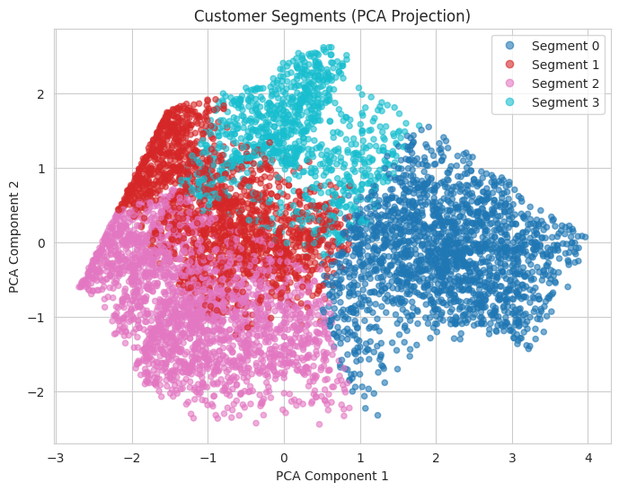
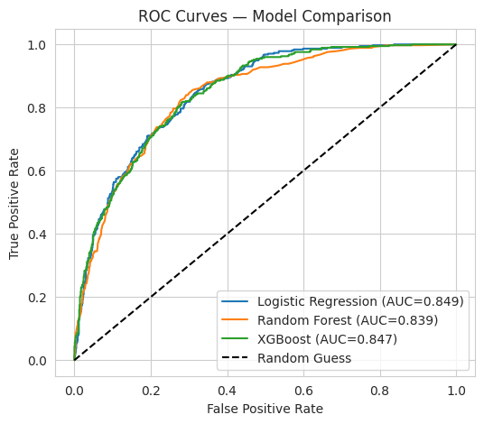
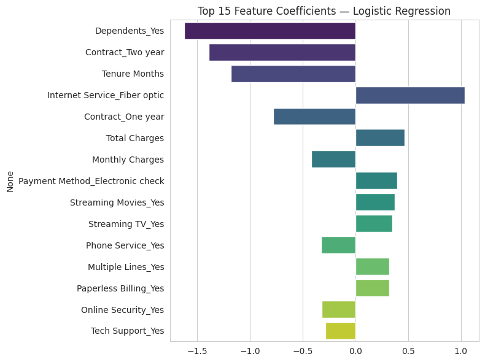
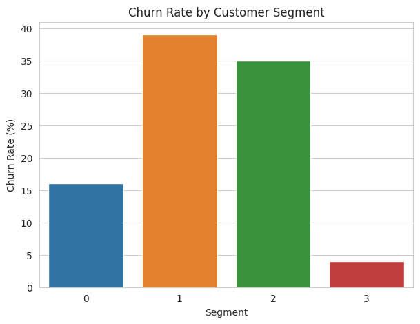

# Customer Segmentation and Churn Prediction

Customer segmentation and churn prediction on the IBM Telco Customer Churn dataset — combining unsupervised learning (K-Means clustering) with supervised classification models to identify at-risk customer segments and surface the strongest churn drivers.

## Overview

This project analyzes a telecom company's customer base to:

1. Perform exploratory data analysis (EDA) to understand churn drivers.
2. Segment customers into distinct groups using K-Means clustering based on tenure, billing, and lifetime-value attributes.
3. Build and evaluate supervised models (Logistic Regression, Random Forest, XGBoost) to predict customer churn.
4. Combine both analyses into actionable, segment-specific retention recommendations.

**Dataset:** [IBM Telco Customer Churn](https://www.kaggle.com/datasets/blastchar/telco-customer-churn) — 7,043 customers, 33 attributes covering demographics, account information, subscribed services, billing, and churn status.

**Tools:** Python, Pandas, NumPy, Matplotlib, Seaborn, Scikit-learn, XGBoost.

## Results at a Glance

| Metric | Value |
|---|---|
| Overall churn rate | 26.5% |
| Best models | Logistic Regression / XGBoost |
| ROC-AUC | ~0.85 |
| Recall (churned class) | ~0.78 |
| Customer segments found | 4 |

<p align="center">
  
  
</p>

<p align="center">
  
  
</p>

K-Means clustering on tenure, billing, and CLTV reveals four customer segments with very different risk profiles, ranging from a **"Stable Budget Loyalists"** segment churning at only ~4% to an **"At-Risk Newcomers"** segment churning at ~39%.

<p align="center">
  
</p>

## Key Findings

- Customers on **month-to-month contracts** churn far more than those on one- or two-year contracts — contract type is the single strongest churn predictor.
- **Lower-tenure** customers churn more; risk drops sharply after the first year.
- **Fiber optic** internet customers show higher churn than DSL or no-internet customers.
- Two of the four customer segments ("At-Risk Newcomers" and "Low-CLTV Flight Risks") account for the majority of churn risk in the base.

## Project Structure

```
.
├── Customer_Segmentation_Churn_Prediction.ipynb   # Main analysis notebook
├── images/                                         # Result charts (used in this README)
├── requirements.txt
├── LICENSE
└── README.md
```

## Getting Started

### 1. Clone the repo

```bash
git clone https://github.com/<your-username>/customer-segmentation-churn-prediction.git
cd customer-segmentation-churn-prediction
```

### 2. Install dependencies

```bash
pip install -r requirements.txt
```

### 3. Get the dataset

The raw dataset isn't included in this repo. Download `Telco_customer_churn.xlsx` from the [Kaggle IBM Telco Customer Churn page](https://www.kaggle.com/datasets/blastchar/telco-customer-churn) and place it in the project root (same folder as the notebook).

### 4. Run the notebook

```bash
jupyter notebook Customer_Segmentation_Churn_Prediction.ipynb
```

## Approach

### Data Cleaning
- Converted `Total Charges` from text to numeric (blank values correspond to brand-new customers with 0 tenure).
- Dropped identifier and geographic columns (`CustomerID`, `Zip Code`, `Lat Long`, etc.) that add no general predictive value.
- Dropped `Churn Score` and `Churn Reason` to avoid target leakage — these are only known after a customer has already churned or are IBM's own pre-computed risk score.

### Segmentation (Unsupervised)
Customers are segmented using an RFM-inspired feature set adapted for a subscription business: **Tenure Months**, **Monthly Charges**, **Total Charges**, and **CLTV**. Features are standardized and clustered with K-Means; the number of clusters (k=4) is chosen using the elbow method and silhouette score.

### Churn Prediction (Supervised)
Three classifiers — Logistic Regression, Random Forest, and XGBoost — are trained on a stratified 80/20 split, with class imbalance handled via `class_weight="balanced"` / `scale_pos_weight`. Models are compared on Accuracy, Precision, Recall, F1, and ROC-AUC, with recall on the churned class weighted most heavily (missing an at-risk customer is costlier than a false alarm).

## Business Recommendations

1. **Prioritize the "At-Risk Newcomers" and "Low-CLTV Flight Risks" segments** for proactive retention outreach.
2. **Incentivize contract upgrades** from month-to-month to annual plans via loyalty discounts.
3. **Investigate fiber-optic service quality/pricing**, given its disproportionately high churn.
4. **Deploy the trained churn model in production** to score customers monthly and route the highest-risk, highest-CLTV customers to the retention team first.
5. **Re-run clustering periodically** (e.g., quarterly) as customer behavior shifts.

## License

This project is licensed under the MIT License — see [LICENSE](LICENSE) for details.
